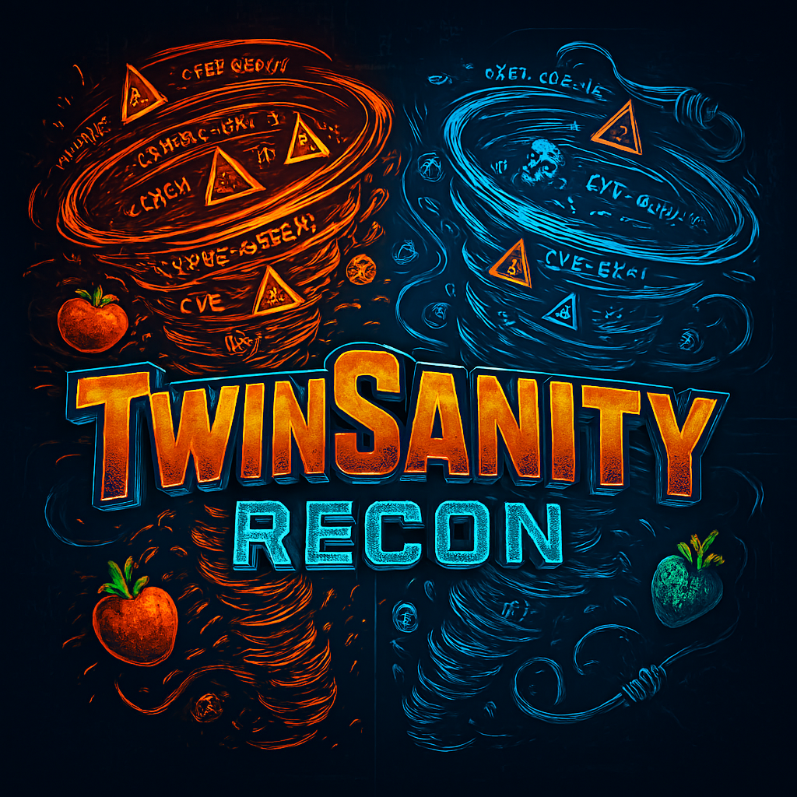

# TwinSanity Recon

<div align="center">

  


**An Advanced AI-Powered Reconnaissance & Vulnerability Assessment Platform**

[](https://foam-gram-874.notion.site/TwinSanity-Recon-2ef80f079ebe80a99073dc323ce49776)

[Features](#-features) • [Configuration](#️-configuration) • [Installation](#-installation) • [Quick Start](#-quick-start) • [Architecture](#️-architecture) • [Security](#-security) • [Troubleshooting](#-troubleshooting) • [License](#-license)

</div>

---

## 📋 Overview

TwinSanity Recon is a comprehensive, web-based reconnaissance platform designed for security professionals and penetration testers. It combines traditional subdomain enumeration, port scanning, and vulnerability detection with modern AI-powered analysis capabilities.

### Key Highlights

- 🔍 **Multi-Source Subdomain Discovery** - Aggregates data from 10+ sources (crt.sh, SecurityTrails, VirusTotal, Chaos, etc.)
- 🌐 **Real-Time Web Dashboard** - Modern, responsive UI with WebSocket-powered live updates
- 🤖 **AI-Powered Analysis** - Integrates with multiple LLM providers (Gemini, OpenAI, Ollama, Anthropic)
- 🛡️ **Vulnerability Detection** - Nuclei integration with CVE enrichment from NVD/Shodan
- 📊 **Comprehensive Reporting** - HTML/PDF reports with executive summaries
- 🔐 **Enterprise Security** - Role-based access control, rate limiting, audit logging

---

## ✨ Features

### Reconnaissance Capabilities

| Feature | Description |
|---------|-------------|
| **Subdomain Enumeration** | Passive collection from crt.sh, SecurityTrails, VirusTotal, Chaos, ThreatCrowd, HackerTarget, Anubis, AlienVault OTX |
| **DNS Resolution** | Bulk async DNS resolution with multiple record types (A, AAAA, CNAME, MX, TXT, NS) |
| **HTTP Probing** | Alive host detection with status codes, titles, technologies, and response analysis |
| **Port Scanning** | Integration with Shodan InternetDB for passive port/service discovery |
| **Vulnerability Scanning** | Nuclei template execution with severity classification (not stable) |
| **XSS Detection** | Automated XSS vulnerability scanning with payload injection |
| **URL Harvesting** | Wayback Machine, Common Crawl, and AlienVault URL collection |
| **API Discovery** | Endpoint enumeration from JavaScript files and web archives |

### AI Analysis Features

| Provider | Capabilities |
|----------|--------------|
| **Google Gemini** | Primary analysis provider with high context window |
| **OpenAI GPT-4** | Advanced reasoning and vulnerability assessment |
| **Anthropic Claude** | Security-focused analysis with safety guardrails |
| **Local Ollama** | Privacy-preserving on-premise analysis |
| **GitHub Models** | Access to multiple open-source models |

### Dashboard Features

- **Real-Time Scan Progress** - WebSocket-powered live updates
- **Interactive Results Explorer** - Filterable, searchable findings
- **AI Chat Interface** - Conversational analysis with scan context
- **Project File Manager** - Browse results, wordlists, reports
- **Admin Panel** - User management, system configuration
- **Super Admin Role** - Primary admin with elevated privileges
- **Public Scan Sharing** - Share findings with team members
- **Smart Rescan** - Automatically clears cache for fresh reconnaissance

---

## ⚙️ Configuration

All configuration is managed in `config.yaml`. Here are the important sections users should customize:

### 🔑 API Keys (Required for Full Functionality)

Before running TwinSanity Recon, configure your API keys in `config.yaml`:

```yaml
api_keys:
  # ═══════════════════════════════════════════════════════════════════════════
  # RECONNAISSANCE APIs (Optional but Recommended)
  # ═══════════════════════════════════════════════════════════════════════════
  shodan: 'your-key'        # https://account.shodan.io/ - Enhanced port/CVE data
                            # Note: InternetDB works without a key, but full API is better
  virustotal: 'your-key'    # https://www.virustotal.com/gui/my-apikey - Subdomain discovery
  nvd: 'your-key'           # https://nvd.nist.gov/developers/ - CVE enrichment
  securitytrails: ''        # https://securitytrails.com/corp/api - Premium subdomain data
  chaos: 'your-key'         # https://chaos.projectdiscovery.io/ - ProjectDiscovery data
  
  # ═══════════════════════════════════════════════════════════════════════════
  # AI/LLM PROVIDER APIs (At Least ONE Required for AI Analysis)
  # ═══════════════════════════════════════════════════════════════════════════
  gemini: 'your-key'        # https://aistudio.google.com/app/apikey - PRIMARY AI (FREE)
  openai: ''                # https://platform.openai.com/api-keys - GPT models (paid)
  anthropic: ''             # https://console.anthropic.com/ - Claude models (paid)
  github: ''                # https://github.com/settings/tokens - GitHub Models (free)
  ollama_cloud: 'your-key'  # Hosted Ollama API key (if using cloud Ollama service)
```

> ⚠️ **IMPORTANT**: You need **at least one AI provider key** (Gemini recommended - it's free!) for AI-powered analysis. Without any AI key configured, the AI Analysis feature will be disabled.
>
> 💡 **For Local AI**: Install [Ollama](https://ollama.com/download) locally and it works without any API key!

### 🧠 LLM/AI Configuration

```yaml
llm:
  defaults:
    analysis: gemini        # Default provider for scan analysis (gemini/local/ollama_cloud)
    chat: local             # Default provider for chat (local = Ollama)
  
  providers:
    gemini:
      model: gemini-2.0-flash    # Model to use
      timeout: 90                 # Request timeout in seconds
    
    local:                        # Local Ollama configuration
      host: http://127.0.0.1:11434
      models:
        default: llama3.1:latest
        reasoning: deepseek-r1:8b
        fast: nous-hermes2:latest
    
    ollama_cloud:
      host: https://ollama.com
      model: deepseek-v3.1:671b
```

### 🌐 Subdomain Sources

Enable/disable individual subdomain enumeration sources:

```yaml
subdomain_sources:
  crtsh:
    enabled: true           # Certificate Transparency logs
  virustotal:
    enabled: true           # Requires API key
  shodan:
    enabled: true           # Shodan search
  hackertarget:
    enabled: true           # Free DNS lookup
  alienvault:
    enabled: true           # AlienVault OTX
  # ... more sources available
```

### 🔒 Security Settings

```yaml
security:
  auth_enabled: true        # Disable only for local testing!
  session:
    password_min_length: 8
    max_login_attempts: 5   # Lockout after N failed attempts
    lockout_minutes: 15     # Lockout duration
    session_hours: 24       # Session expiry
  rate_limiting:
    enabled: true
    scan_per_minute: 5      # Max scans per minute
    chat_per_minute: 30     # Max AI chat messages per minute
```

### 🔍 Scan Tool Defaults

Control which tools are enabled by default in the UI:

```yaml
http_probing:
  enabled: true             # HTTP alive detection
  concurrency: 50           # Parallel connections
  timeout: 10

nuclei:
  enabled: false            # Vulnerability scanning (requires Nuclei installed)
  severity: critical,high   # Only show critical/high findings
  
url_harvesting:
  enabled: true             # Wayback/CommonCrawl URL collection

xss_scan:
  enabled: false            # XSS vulnerability scanning

api_discovery:
  enabled: true             # API endpoint discovery from JS files
```

### 📊 Report Settings

```yaml
reports:
  directory: reports
  default_format: html
  organization: 'Your Company Name'  # Appears in report headers
  disclaimer: 'Confidential...'       # Legal disclaimer text
```

### 🌐 Proxy Configuration (Optional)

```yaml
proxy:
  enabled: false
  single_proxy: 'http://proxy:port'   # Use single proxy
  proxy_file: 'proxies.txt'           # Or load from file
  rotation_mode: round_robin          # round_robin or random
```

### Changing Default Scan Options

The default state of scan toggle checkboxes (HTTP Probing, Nuclei, URL Harvesting, AI Analysis, etc.) is controlled by `config.yaml`. When the dashboard loads, it fetches these defaults via the `/api/config/scan-defaults` endpoint.

To change which options are enabled by default:

```yaml
# config.yaml
http_probing:
  enabled: false  # Disable HTTP probing by default

nuclei:
  enabled: false  # Disable Nuclei scanning by default

url_harvesting:
  enabled: false  # Disable URL harvesting by default

llm:
  analysis:
    enabled: false  # Disable AI analysis by default
```


## 🚀 Installation

### Prerequisites

- Python 3.10 or higher
- pip (Python package manager)
- Git
- [Nuclei](https://github.com/projectdiscovery/nuclei) (optional, for vulnerability scanning)
- [wkhtmltopdf](https://wkhtmltopdf.org/) (optional, for Windows PDF reports)
- [ollama](https://ollama.com/download) (optional, for Local AI analysis\chat assistant)


### Quick Install


```bash
# Clone the repository
git clone https://github.com/MustafaCyb/TwinSanity-Recon.git
cd TwinSanity-Recon

# Create virtual environment
python -m venv venv
source venv/bin/activate  # Linux/macOS
# or
.\venv\Scripts\activate   # Windows

# Install dependencies
pip install -r requirements.txt

# Run the dashboard
python run_dashboard.py

---

## 🏁 Quick Start

### 1. Configure API Keys

Edit `config.yaml` and add your API keys:

```yaml
api_keys:
  shodan: 'your-shodan-api-key'        # Optional - InternetDB works without
  gemini: 'your-gemini-api-key'        # Required for AI analysis
  virustotal: 'your-virustotal-key'    # Optional - enhances subdomain discovery
  nvd: 'your-nvd-api-key'              # Optional - CVE enrichment
  ollama_cloud: 'your-ollama-cloud-api-key'  # very improtant - for AI analysis
```

### 2. Start the Dashboard

```bash
python run_dashboard.py
```

Access the dashboard at: **http://127.0.0.1:8888**

### 3. First-Time Setup

On first launch, you'll be prompted to create an admin account:
1. Enter your desired username (min 3 characters)
2. Create a strong password (min 8 characters)
3. Click "Create Suber-Admin account & Login"

### 4. Run Your First Scan

1. Enter a target domain (e.g., `example.com`)
2. Select scan options:
   - **Subdomain Sources**: Choose which data sources to query
   - **Enable AI Analysis**: Toggle LLM-powered insights
3. Click **Start Scan**
4. Monitor real-time progress via the dashboard

---

## 🏗️ Architecture

### System Overview

```mermaid
flowchart TB
    subgraph Frontend["🖥️ Frontend Layer"]
        UI["HTML/JS Dashboard"]
        WS["WebSocket Client"]
    end

    subgraph Backend["⚙️ FastAPI Backend"]
        API["REST API Routes"]
        AUTH["Auth Middleware"]
        WSM["WebSocket Manager"]
    end

    subgraph Services["🔧 Core Services"]
        SCAN["Scanner Engine"]
        DNS["DNS Resolver"]
        HTTP["HTTP Prober"]
        NUCLEI["Nuclei Scanner"]
        XSS["XSS Scanner"]
        HARVEST["URL Harvester"]
    end

    subgraph AI["🧠 AI Layer"]
        LLM["LLM Manager"]
        GEMINI["Gemini API"]
        OLLAMA["Ollama Local"]
        OPENAI["OpenAI API"]
    end

    subgraph Data["💾 Data Layer"]
        DB[("SQLite DB")]
        CACHE["Results Cache"]
        FILES["File Storage"]
    end

    subgraph External["🌐 External APIs"]
        SHODAN["Shodan"]
        VT["VirusTotal"]
        CRTSH["crt.sh"]
        CHAOS["Chaos"]
    end

    UI <-->|HTTP/WS| API
    WS <-->|Real-time| WSM
    API --> AUTH
    AUTH --> SCAN
    SCAN --> DNS
    SCAN --> HTTP
    SCAN --> NUCLEI
    SCAN --> XSS
    SCAN --> HARVEST
    SCAN --> External
    API --> LLM
    LLM --> GEMINI
    LLM --> OLLAMA
    LLM --> OPENAI
    SCAN --> DB
    SCAN --> CACHE
    API --> FILES

    style Frontend fill:#2d3748,stroke:#4fd1c5,stroke-width:2px
    style Backend fill:#2d3748,stroke:#f6ad55,stroke-width:2px
    style Services fill:#2d3748,stroke:#fc8181,stroke-width:2px
    style AI fill:#2d3748,stroke:#b794f4,stroke-width:2px
    style Data fill:#2d3748,stroke:#68d391,stroke-width:2px
    style External fill:#2d3748,stroke:#63b3ed,stroke-width:2px
```




### Technology Stack

| Layer | Technology |
|-------|------------|
| **Backend** | Python 3.10+, FastAPI, asyncio |
| **Database** | SQLite with aiosqlite (WAL mode) |
| **Frontend** | Vanilla JavaScript, CSS3, WebSockets |
| **AI/ML** | Google Generative AI, OpenAI, Ollama |
| **Security** | PBKDF2-SHA256, slowapi, CORS |
| **Scanning** | Nuclei, custom async scanners |

---

## 🔐 Security

### Authentication & Authorization

- **Session-Based Auth**: Secure HTTP-only cookies
- **Password Hashing**: PBKDF2-SHA256 with 100,000 iterations + random salt
- **Brute Force Protection**: Account lockout after 5 failed attempts (15 min)
- **Role-Based Access Control**: Super Admin, Admin, and User roles
- **Role Hierarchy Protection**: Lower roles cannot access higher role data
- **IDOR Prevention**: All scan/report access verified against user ownership
- **API Authentication**: All tools and report endpoints require authentication

### Security Headers

```
X-Content-Type-Options: nosniff
X-Frame-Options: DENY
X-XSS-Protection: 1; mode=block
Referrer-Policy: strict-origin-when-cross-origin
Permissions-Policy: geolocation=(), microphone=()
```

### Input Validation

- **Domain Validation**: Blocks internal IPs (127.x, 10.x, 192.168.x, etc.)
- **Path Traversal Protection**: All file operations validated against allowed roots
- **SSRF Prevention**: IP blocklist for scanner targets
- **Prompt Injection Mitigation**: LLM input sanitization

### Audit Logging

All sensitive operations are logged to `logs/audit.log`:
- Authentication events
- Scan initiations
- Configuration changes
- LLM API calls

---


## 📊 Performance


### Optimization Tips

- Use proxy rotation for large scans
- Enable result caching in config
- Adjust rate limits per source
- Use local Ollama for privacy

---

## 🐛 Troubleshooting

### Common Issues

**"Cannot connect to database"**
```bash
# Ensure data directory exists
mkdir -p data
# Check permissions
chmod 755 data/
```

**"Nuclei not found"**
```bash
# Install Nuclei
go install -v github.com/projectdiscovery/nuclei/v3/cmd/nuclei@latest
# Or download binary from releases
```

**"AI analysis failing"**
- Check API key in `config.yaml`
- Verify API quota hasn't been exceeded
- Try switching to local Ollama provider

**"WebSocket disconnecting"**
- Check firewall/proxy settings
- Increase timeout in reverse proxy config

---

## 📜 License

This project is licensed under the MIT License - see the [LICENSE](LICENSE) file for details.

---

### Contributing

1. Fork the repository
2. Create a feature branch (`git checkout -b feature/amazing-feature`)
3. Commit changes (`git commit -m 'Add amazing feature'`)
4. Push to branch (`git push origin feature/amazing-feature`)
5. Open a Pull Request

---


<div align="center">

**Built with ❤️ for the Security Community**

⭐ Star this repo if you find it useful!

</div>
