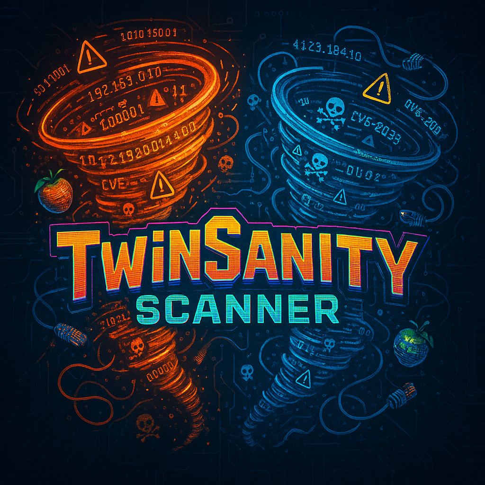

# 🎮 TwinSanity Scanner 🔥

<div align="center">
  
</div>


> **🌪️ N.Sanity is NOT enough, let's DOUBLE THE CHAOS! 🌪️**
> 
> *Welcome to the most TWISTED cybersecurity scanner in the multiverse - where reality bends and vulnerabilities EXPLODE into existence!*

---

## 💥 **THE CHAOS BEGINS HERE** 💥

Born from the interdimensional madness of Crash TwinSanity, this scanner doesn't just find vulnerabilities - it **DEMOLISHES** the boundaries between discovery and destruction! Like N. Tropy's time-splitting antics, TwinSanity Scanner fractures your reconnaissance into parallel dimensions of PURE SCANNING POWER!

### 🎭 **TWISTED FEATURES** 
```
╔══════════════════════════════════════════════════════════════╗
║  🚀 WARP ZONE SCANNING: Subdomain discovery at light speed   ║
║  🔥 NITRO BOOST: Multi-threaded chaos across the network     ║
║  🎯 QUANTUM TARGETING: AI-powered threat hunting madness     ║
║  💎 GEM COLLECTION: CVE hunting from multiple dimensions     ║
║  🌀 SPIN ATTACK: Proxy rotation for stealth operations       ║
║  📊 CORTEX ANALYSIS: Professional reports that WOW           ║
╚══════════════════════════════════════════════════════════════╝
```

---

## 🏃‍♂️ **CRASH COURSE: GET STARTED** 

### ⚡ **POWER-UP INSTALLATION**
```bash
# 🎮 Clone the chaos
git clone https://github.com/yourusername/twinsanity-scanner.git
cd twinsanity-scanner

# 💣 Arm your scanner with dependencies
pip install -r requirements.txt

# 🔑 Unlock the vault of secrets
cp .env.example .env
# ⚠️ Edit .env with your API keys - DON'T GET CAUGHT WITHOUT THEM!
```

### 🤖 **LOCAL AI SETUP (Optional but POWERFUL!)**
For maximum chaos with local AI models:
```bash
# Download and install Ollama for local LLM power
curl -fsSL https://ollama.com/install.sh | sh

# Pull a powerful model for analysis
ollama pull nous-hermes2:latest
# Or try other models like:
ollama pull llama2:13b
ollama pull codellama:latest
```
📚 **Ollama Resources:**
- 🔗 [Official Ollama Download](https://ollama.com/download)
- 🔗 [Ollama Model Library](https://ollama.com/library)
- 🔗 [Ollama GitHub Repository](https://github.com/ollama/ollama)

### 🗝️ **SECRET COMBINATIONS (.env)**
```env
# 🌟 Your arsenal of API keys
SHODAN_API_KEY=your_shodan_portal_key
GEMINI_API_KEY=your_gemini_dimension_key  
NVD_API_KEY=your_nvd_crystal_key
OLLAMA_API_KEY=your_ollama_warp_key
```

### 🎯 **API KEY ACQUISITION MISSIONS**

| Service | Purpose | Get Your Key |
|---------|---------|--------------|
| 🔥 **Shodan** | Internet-wide device scanning | [Get Shodan API Key](https://account.shodan.io/register) |
| 🌟 **Google Gemini** | AI-powered vulnerability analysis | [Get Gemini API Key](https://aistudio.google.com/app/apikey) |
| 🛡️ **NVD** | Enhanced CVE details (optional) | [Get NVD API Key](https://nvd.nist.gov/developers/request-an-api-key) |
| ☁️ **Ollama Cloud** | Cloud-based LLM processing | [Get Ollama Cloud Access](https://ollama.com/settings/keys) |

> 💡 **PRO TIP**: The NVD API key is optional but recommended for faster CVE lookups and higher rate limits!

---

## 🎯 **COMBAT MOVES & ATTACK PATTERNS**

### 🌪️ **BASIC SPIN ATTACK**
```bash
# Simple but effective - like Crash's classic move!
python TwinSanty_Scanner.py -d evil-corp.com -o destruction/
```

### 🚀 **NITRO BOOST COMBO**
```bash
# MAXIMUM OVERDRIVE with AI analysis
python TwinSanty_Scanner.py -d target.com -o carnage/ \
    --use-shodan --run-agent --report-name "CHAOS_REPORT.html"
```

### 💥 **CORTEX STRIKE** 
```bash
# Full-scale interdimensional assault
python TwinSanty_Scanner.py \
    -d victim-domain.com \
    -o "TOTAL_ANNIHILATION/" \
    --bruteforce \
    --wordlist "weapons/massive_wordlist.txt" \
    --use-shodan \
    --run-agent \
    --concurrency 42 \
    --cve-sources all \
    --delay 0.5
```

### 🎭 **STEALTH SHADOW CLONE**
```bash
# Like N. Gin's sneaky robots
python TwinSanty_Scanner.py \
    -d classified-target.mil \
    -o "shadow_ops/" \
    --proxies-file "stealth/proxy_army.txt" \
    --proxy-rotate \
    --delay 3.0 \
    --concurrency 5
```

---

## 🎮 **POWER-UPS & SPECIAL ABILITIES**

<details>
<summary>🎯 <b>TARGETING SYSTEMS</b></summary>

```bash
-d, --domain          🎯 Lock onto primary target
-i, --input           📋 Load target list from intel file  
--input-as-domains    🌐 Treat each line as a new dimension
```
</details>

<details>
<summary>💥 <b>DESTRUCTION PARAMETERS</b></summary>

```bash
-o, --output          💾 Choose your battlefield folder
--report-name         📊 Name your victory report
--save-host-files     🗃️  Keep trophies of each conquest
```
</details>

<details>
<summary>⚡ <b>CHAOS AMPLIFIERS</b></summary>

```bash
-c, --concurrency     🚀 Parallel dimension count (default: 20)
--timeout             ⏰ Portal stability time (default: 15 sec)
--delay               😴 Stealth pause between strikes
--use-shodan          🔥 Activate the SHODAN MATRIX
--bruteforce          💣 Enable dictionary attack mode
-w, --wordlist        📖 Load your weapon of choice
```
</details>

<details>
<summary>💎 <b>CVE COLLECTION MATRIX</b></summary>

```bash
--cve-sources         🎲 Pick your intel sources (circl,nvd,shodan,all)
--max-cve-workers-*   👥 Control your army size
```
</details>

<details>
<summary>👤 <b>STEALTH OPERATIONS</b></summary>

```bash
-P, --proxies-file    🕵️ Load your disguise collection
-PR, --proxy-rotate   🌀 Spin through identities
```
</details>

<details>
<summary>🤖 <b>AI CORTEX ACTIVATION</b></summary>

```bash
--run-agent           🧠 Deploy the AI overlord
--report-only         📈 Generate intel without scanning
```
</details>

---

## 🏆 **LOOT & REWARDS SYSTEM**

Your victories are stored in organized chaos:

```
🎮 GAME_RESULTS/
├── 💎 results_all.json          ← THE MASTER COLLECTION
├── 📊 summary.csv               ← SCOREBOARD SUMMARY  
├── 🧠 cve_cache.json           ← VULNERABILITY VAULT
├── 🎯 individual_targets/       ← TROPHY ROOM
├── 📋 REPORTS/
│   ├── 🤖 aggregated_results.json  ← AI BRAIN DUMP
│   └── 🏆 VICTORY_REPORT.html      ← YOUR EPIC SAGA
└── 📝 agent.log                ← BATTLE CHRONICLES
```

---

## 🤖 **THE CORTEX AI OVERLORD** 

Channel the power of Dr. Cortex himself with multiple AI dimensions:

### **🧠 THE HIERARCHY OF INTELLIGENCE**
1. **🌟 GEMINI DIMENSION** (Primary Reality)
2. **☁️ OLLAMA CLOUD** (Backup Universe) 
3. **🏠 OLLAMA LOCAL** (Emergency Fallback)

### **⚙️ CORTEX CONFIGURATION**
```bash
python agent.py \
    --json "raw_intel.json" \
    --output "MASTER_PLAN.html" \
    --chunk-size 8 \
    --cloud-model "gpt-oss:120b" \
    --local-model "nous-hermes2:latest" \
    --gemini-model "gemini-2.0-flash"
```

---

## 🎪 **BOSS BATTLE SCENARIOS**

### 🏢 **CORPORATE FORTRESS ASSAULT**
```bash
# Full corporate infiltration - Cortex style!
python TwinSanty_Scanner.py \
    -d "megacorp-industries.com" \
    -o "CORPORATE_DESTRUCTION/" \
    --bruteforce \
    --wordlist "arsenal/corporate_subs.txt" \
    --use-shodan \
    --run-agent \
    --concurrency 50 \
    --report-name "CORPORATE_DOWNFALL.html"
```

### 🕵️ **GHOST PROTOCOL OPERATION**  
```bash
# Maximum stealth like Ripper Roo's sneaky traps
python TwinSanty_Scanner.py \
    -d "top-secret-facility.gov" \
    -o "CLASSIFIED_INTEL/" \
    --proxies-file "ghost_proxies.txt" \
    --proxy-rotate \
    --delay 5.0 \
    --concurrency 3 \
    --cve-sources "circl,nvd"
```

### 🌊 **TSUNAMI SCAN WAVE**
```bash
# Like a Crash beach level - overwhelming force!  
python TwinSanty_Scanner.py \
    -i "target_empire.txt" \
    --input-as-domains \
    -o "TSUNAMI_RESULTS/" \
    --use-shodan \
    --run-agent \
    --concurrency 100 \
    --max-cve-workers-global 50
```

---

## 🛡️ **SAFETY PROTOCOLS** 
*Even chaos needs rules!*

### ⚠️ **WARNING SIGNS**
```
🚨 RATE LIMIT DETECTED → Reduce --concurrency, add --delay
🚨 CVE FETCH FAILING → Try different --cve-sources  
🚨 MEMORY OVERLOAD → Lower --chunk-size for AI analysis
🚨 PROXY ISSUES → Check your proxy list format
```

### 🔒 **RESPONSIBLE CHAOS**
- Only target systems you OWN or have PERMISSION to scan
- Store API keys in `.env` files, NOT in your code
- Use delays and rate limiting to be a good netizen  
- Consider proxy rotation for sensitive assessments

---

## 🎨 **CONTRIBUTING TO THE MADNESS**

Want to add more chaos to the mix?

1. **🍴 FORK** the reality
2. **🌿 BRANCH** into a new dimension (`git checkout -b feature/insane-addition`)
3. **💾 COMMIT** your chaos (`git commit -m 'Add interdimensional scanner'`)
4. **🚀 PUSH** to your reality (`git push origin feature/insane-addition`)
5. **🔀 MERGE** realities with a Pull Request

---

## 🎭 **HALL OF FAME**

Special thanks to the chaos creators:
- **Shodan.io** - For providing the all-seeing eye
- **Certificate Transparency** - The crystal ball of domains  
- **CIRCL & NVD** - The vulnerability archives
- **The Crash Bandicoot Universe** - For inspiring pure madness

---

## ⚖️ **LEGAL CHAOS DISCLAIMER**

```
🎮 THIS TOOL IS FOR LEGITIMATE SECURITY TESTING ONLY! 🎮

Like Crash collecting Wumpa fruit, collect vulnerabilities RESPONSIBLY!
The developers are NOT responsible if you go full N. Tropy on 
unauthorized systems. Don't be a Ripper Roo - get permission first!
```

---

## 🎪 **THE FINAL BOSS CREDITS**

*Licensed under MIT - Because even chaos needs structure*

**🌪️ REMEMBER: In the TwinSanity dimension, there's no such thing as too much chaos - only not enough WUMPA FRUIT! 🍎**

```
╔══════════════════════════════════════════════════════════════╗
║           🎮 MADE WITH CRASH-LEVEL INSANITY 🎮              ║  
║              💥 DOUBLE THE SANITY, DOUBLE THE FUN! 💥        ║
╚══════════════════════════════════════════════════════════════╝
```

---
*🎭 Now go forth and scan with the power of INTERDIMENSIONAL CHAOS! 🎭*
